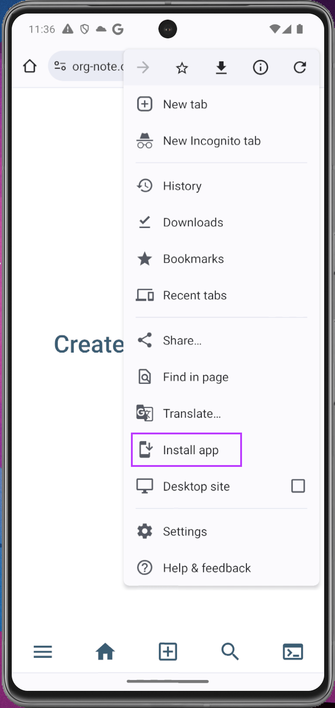
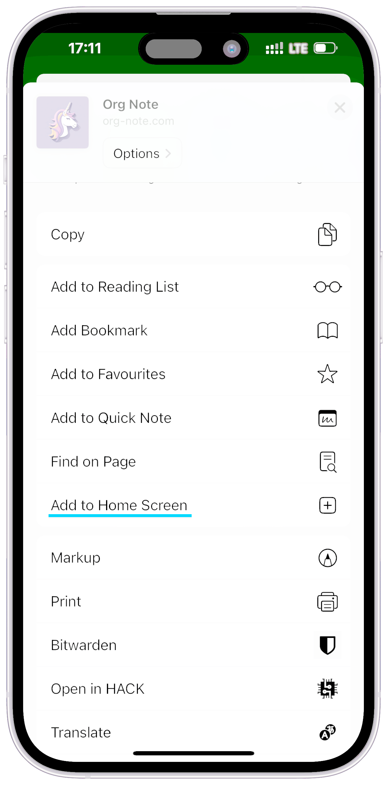
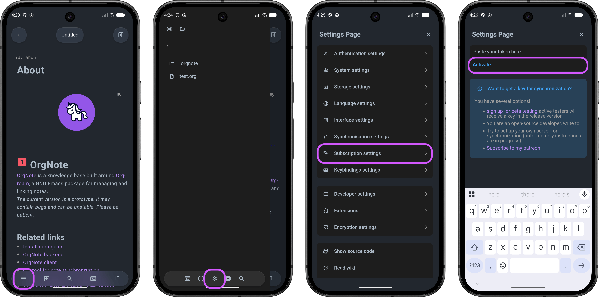
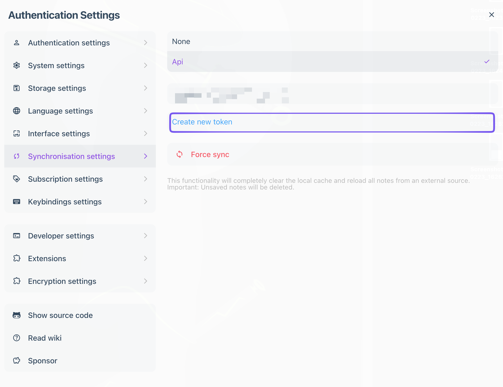

:PROPERTIES:
:ID: installation-guide
:END:

#+TITLE: Usage guide
#+DESCRIPTION: Common questions and instructions how to install development version
#+FILETAGS: :orgnote:installation:
#+STARTUP: content

* Links
- [[./info.org][About the project]]

* Guide
This guide describes how to work with the [[https://dev.org-note.com/][development]] version of the app. The main application is currently unmaintained as it was just a prototype for proof of concept.

* How can I use it?

** Web application
You can use the app via your browser by going to [[https://dev.org-note.com/][development client server]]

There are a few limitations:

1. By default, data is stored locally via IndexedDB. This means that without synchronization, you may lose your data if you reinstall the app or clear your browser data.
2. Synchronization is available for test users and [[https://www.patreon.com/c/artawower?vanity=user][Patreon subscribers]]. 
   If you would like to join to the testing, consider to register your email on [[https://about.org-note.com/]] website
3. The app is in early development and may contain bugs. *Please back up your data before syncing.*

** PWA
The application is available as a [[https://developer.mozilla.org/en-US/docs/Web/Progressive_web_apps][PWA]]. You can install it on your Android/iOS device home screen and use it like a regular app. It has the same limitations as the web application, plus offline support.

*** How to install the app on the android? 
- Firstly, navigate to the [[https://dev.org-note.com/][development version of the app]] via chrome
- Press the “three dot” icon in the upper right to open the menu. Select “Add to Home screen”.

*** How to install the app on the iOS device?
- Firstly, navigate to the [[https://dev.org-note.com/][development version of the app]] via chrome
- Press the “share” icon in the bottom center to open the menu. Select “Add to Home screen”.

** Android
You can download the latest Android version [[https://github.com/Artawower/orgnote-client/releases][here]]. On Android, you can use native file system support, so you can easily sync your notes with tools like Syncthing. You can also use it offline without any limitations.

** Desktop
Currently there is no desktop build; you can build it yourself from source. I'll add a desktop release later.

* How to synchronize notes?** CLI
*WARNING* Synchronization is under development and could be unstable. Please back up your notes before using it.

Right now synchronization is only available with the orgnote-backend server. It can be self-hosted (instructions will be added later) or you can use public server - https://dev.org-note.com

** Prerequisites
1. Getting an API token for syncing notes

Currently, it is in beta testing, and you have the following options to obtain a subscription token:

- Become an open-source contributor (contact us from your GitHub email at app.orgnote@gmail.com)
- [[https://www.patreon.com/c/artawower?vanity=user][Become my patron on Patreon]].
- You are an active tester of the application.
- You help the project in any other way
- Join [[https://about.org-note.com/][beta]] test The number of accounts is limited, priority to open source Developers
- Use a self-hosted solution (instructions will be available soon).

Once approved, you will receive an email token (not to be confused with an API token) to activate your account (check your spam folder). By default, beta users receive 25MB of storage, which is enough for testing and small note collections. 

For Patreon subscribers and open-source contributors, storage can be increased up to 100MB or 300MB depending on subscription tier and contribution level.

** Client
To activate your subscription on the client, enter the provided token in the app. (Usually this is done automatically by following the link in the email, but if you encounter issues, you can do it manually.)

*Important*: Next, you need to generate an API key (this differs from the token you received by email!):

Go to [[https://dev.org-note.com/?execute=%7B%22command%22%3A%22synchronisation+settings%22%7D][synchronisation settings]] and press "create new token". 

This token will be used for synchronization with CLI tools.

** Config file for CLI and emacs package
You can download the CLI config from the account settings page. Go to [[https://dev.org-note.com/?execute=%7B%22command%22%3A%22synchronisation+settings%22%7D][synchronization settings]] and click "Download local sync config", or use the direct link [[https://dev.org-note.com/?execute=%7B%22command%22%3A%22download+local+sync+config%22%7D][here]]. The only additional step is to set the ~rootFolder~ path in the TOML file: ~rootFolder = "~/tmp/org-roam"~

The config is stored at ~~/.config/orgnote/config.toml~.

** CLI
You can sync notes via CLI utility. See the actual details [[https://github.com/Artawower/orgnote-cli][here]]

To sync notes, you need to have Node.js version 22 or higher.

Install [[https://github.com/Artawower/orgnote-cli][orgnote-cli]] from [[https://www.npmjs.com/package/orgnote-cli][npm]]

#+BEGIN_SRC bash
npm install -g orgnote-cli
#+END_SRC

Create =~/.config/orgnote/config.toml= file with the following content:

#+BEGIN_SRC toml
[[accounts]]
name = "My remote account"
clientAddress = "https://localhost:3001"
remoteAddress = "http://localhost:8000/v1"
token = "your-token-here"
rootFolder = "/tmp/org-roam"
logPath = "/tmp/logs/orgnote.log"
#+END_SRC

*The full config example is available in the [[https://github.com/Artawower/orgnote-cli][CLI README]].*

After that you can run synchronization with the following command:

#+BEGIN_SRC 
orgnote-cli sync --account "My remote account"
#+END_SRC

** Emacs
You can use the official [[https://github.com/artawower/orgnote.el][Emacs package]] for synchronization.

For the development version, use this configuration:

#+BEGIN_SRC emacs-lisp :results silent
(use-package orgnote
  :ensure (:host github :repo "Artawower/orgnote.el" :branch "dev")
  :bind
   ("C-c n F" . orgnote-force-sync)
   ("C-c n S" . orgnote-sync))
  :custom
  (orgnote-debug-p t))
#+END_SRC

You can enable autosync mode via ~orgnote-autosync-global-mode~, which creates a WebSocket connection to the server and automatically syncs notes on save (and vice versa). Alternatively, sync manually using ~orgnote-sync~ and ~orgnote-force-sync~ commands.

*Be careful: synchronization is in early development and may cause data loss. Always back up your data before using it.*

